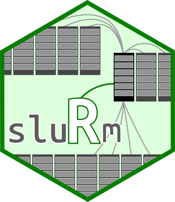

[](https://travis-ci.org/USCbiostats/sluRm)
[](https://codecov.io/gh/USCbiostats/sluRm)
[](https://www.tidyverse.org/lifecycle/#experimental)
[](http://joss.theoj.org/papers/5e1564ca907e4b47accc722ab2913826)

<!-- README.md is generated from README.Rmd. Please edit that file -->

```{r setup, include = FALSE}
options(width = 80)
knitr::opts_chunk$set(
  collapse = TRUE,
  comment = "# ", 
  fig.path = "man/figures/README-",
  out.width = "100%"
)
```


# sluRm: A Lightweight Wrapper for Slurm 

Slurm Workload Manager is a popular HPC cluster job scheduler found in many of the top 500 super computers. The `sluRm` R package provides an R wrapper to it that matches the parallel package's syntax, this is, just like `parallel` provides the `parLapply`, `clusterMap`, `parSapply`, etc., `sluRm` provides `Slurm_lapply`, `Slurm_Map`, `Slurm_sapply`, etc.

While there are other alternatives such as `future.batchtools`, `batchtools`, `clustermq`, and `rslurm`, this R package has the following goals:

1.  It is dependency free, which means that it works out-of-the-box

2.  Puts an emphasis on been similar to the workflow in the R package `parallel`

3.  It provides a general framework for the user to create its own wrappers without using template files.

4.  Is specialized on Slurm, meaning more flexibility (no need to modify template files), and, in the future, better debuging tools (e.g. job resubmission).

Checkout the [VS section](#vs) section for comparing `sluRm` with other R packages.

## Installation


And the development version from [GitHub](https://github.com/) with:

``` r
# install.packages("devtools")
devtools::install_github("USCbiostats/sluRm")
```

## Example 1: Computing means (and looking under the hood)

```{r simple-example}
library(sluRm)

# Suppose that we have 100 vectors of length 50 ~ Unif(0,1)
set.seed(881)
x <- replicate(100, runif(50), simplify = FALSE)
```

We can use the function `Slurm_lapply` to distribute computations

```{r example1}
ans <- Slurm_lapply(x, mean, plan = "none")
Slurm_clean(ans) # Cleaning after you
```

Notice the `plan = "none"` option, this tells `Slurm_lapply` to only create the job object, but do nothing with it, i.e., skip submission. To get more info, we can actually set the verbose mode on

```{r example1-with-verb}
opts_sluRm$verbose_on()
ans <- Slurm_lapply(x, mean, plan = "none")
Slurm_clean(ans) # Cleaning after you
```

## Example 2: Job resubmission

The following example from the package's manual.

```r
# Submitting a simple job
job <- Slurm_EvalQ(sluRm::WhoAmI(), njobs = 20, plan = "submit")

# Checking the status of the job (we can simply print)
job
state(job) # or use the state function
sacct(job) # or get more info with the sactt wrapper.

# Suppose some of the jobs are taking too long to complete (say 1, 2, and 15 through 20)
# we can stop it and resubmit the job as follows:
scancel(job)

# Resubmitting only 
sbatch(job, array = "1,2,15-20") # A new jobid will be assigned

# Once its done, we can collect all the results at once
res <- Slurm_collect(job)

# And clean up if we don't need to use it again
Slurm_clean(res)
```

Take a look at the vignette [here](vignettes/getting-started.Rmd).

## VS

There are several ways to enhance R for HPC. Depending on what are your goals/restrictions/preferences, you can use any of the following:

<table cellspacing="0" border="0">
	<colgroup width="125"></colgroup>
	<colgroup width="85"></colgroup>
	<colgroup width="73"></colgroup>
	<colgroup span="3" width="85"></colgroup>
	<colgroup width="125"></colgroup>
	<colgroup width="104"></colgroup>
	<tbody><tr>
		<td height="36" align="center" valign="middle" bgcolor="#FFFFFF"><b>Package</b></td>
		<td align="center" valign="middle" bgcolor="#FFFFFF"><b>Rerun (1)</b></td>
		<td align="center" valign="middle" bgcolor="#FFFFFF"><b>apply family (2)</b></td>
		<td align="center" valign="middle" bgcolor="#FFFFFF"><b>Slurm options</b></td>
		<td align="center" valign="middle" bgcolor="#FFFFFF"><b>Focus on [blank]</b></td>
		<td align="center" valign="middle" bgcolor="#FFFFFF"><b>System [blank]</b></td>
		<td align="center" valign="middle" bgcolor="#FFFFFF"><b>Dependencies (3)</b></td>
		<td align="center" valign="middle" bgcolor="#FFFFFF"><b>Status</b></td>
	</tr>
	<tr>
		<td style="border-top: 1px solid #000000" height="36" align="left" valign="middle" bgcolor="#FFFFFF"><b>drake</b></td>
		<td style="border-top: 1px solid #000000" align="center" valign="middle" bgcolor="#FFFFFF">yes</td>
		<td style="border-top: 1px solid #000000" align="center" valign="middle" bgcolor="#FFFFFF">no</td>
		<td style="border-top: 1px solid #000000" align="center" valign="middle" bgcolor="#FFFFFF">by template</td>
		<td style="border-top: 1px solid #000000" align="center" valign="middle" bgcolor="#FFFFFF">workflows</td>
		<td style="border-top: 1px solid #000000" align="center" valign="middle" bgcolor="#FFFFFF">agnostic</td>
		<td style="border-top: 1px solid #000000" align="center" valign="middle" bgcolor="#FFFFFF" sdnum="1033;0;@">5/9</td>
		<td style="border-top: 1px solid #000000" align="center" valign="middle" bgcolor="#FFFFFF">active</td>
	</tr>
	<tr>
		<td height="36" align="left" valign="middle" bgcolor="#CCCCCC"><b>sluRm</b></td>
		<td align="center" valign="middle" bgcolor="#CCCCCC">yes</td>
		<td align="center" valign="middle" bgcolor="#CCCCCC">yes</td>
		<td align="center" valign="middle" bgcolor="#CCCCCC">on the fly</td>
		<td align="center" valign="middle" bgcolor="#CCCCCC">calls</td>
		<td align="center" valign="middle" bgcolor="#CCCCCC">specific</td>
		<td align="center" valign="middle" bgcolor="#CCCCCC" sdnum="1033;0;@">0/0</td>
		<td align="center" valign="middle" bgcolor="#CCCCCC">active</td>
	</tr>
	<tr>
		<td height="36" align="left" valign="middle" bgcolor="#FFFFFF"><b>rslurm</b></td>
		<td align="center" valign="middle" bgcolor="#FFFFFF">no</td>
		<td align="center" valign="middle" bgcolor="#FFFFFF">no</td>
		<td align="center" valign="middle" bgcolor="#FFFFFF">on the fly</td>
		<td align="center" valign="middle" bgcolor="#FFFFFF">calls</td>
		<td align="center" valign="middle" bgcolor="#FFFFFF">specific</td>
		<td align="center" valign="middle" bgcolor="#FFFFFF" sdnum="1033;0;@">1/1</td>
		<td align="center" valign="middle" bgcolor="#FFFFFF">inactive (since 2017)</td>
	</tr>
	<tr>
		<td height="36" align="left" valign="middle" bgcolor="#FFFFFF"><b>future.batchtools</b></td>
		<td align="center" valign="middle" bgcolor="#FFFFFF">no</td>
		<td align="center" valign="middle" bgcolor="#FFFFFF">yes</td>
		<td align="center" valign="middle" bgcolor="#FFFFFF">by template</td>
		<td align="center" valign="middle" bgcolor="#FFFFFF">calls</td>
		<td align="center" valign="middle" bgcolor="#FFFFFF">agnostic</td>
		<td align="center" valign="middle" bgcolor="#FFFFFF" sdnum="1033;0;@">2/24</td>
		<td align="center" valign="middle" bgcolor="#FFFFFF">active</td>
	</tr>
	<tr>
		<td height="36" align="left" valign="middle" bgcolor="#FFFFFF"><b>batchtools</b></td>
		<td align="center" valign="middle" bgcolor="#FFFFFF">yes</td>
		<td align="center" valign="middle" bgcolor="#FFFFFF">yes</td>
		<td align="center" valign="middle" bgcolor="#FFFFFF">by template</td>
		<td align="center" valign="middle" bgcolor="#FFFFFF">calls</td>
		<td align="center" valign="middle" bgcolor="#FFFFFF">agnostic</td>
		<td align="center" valign="middle" bgcolor="#FFFFFF" sdnum="1033;0;@">12/20</td>
		<td align="center" valign="middle" bgcolor="#FFFFFF">active</td>
	</tr>
	<tr>
		<td style="border-bottom: 1px solid #000000" height="36" align="left" valign="middle" bgcolor="#FFFFFF"><b>clustermq</b></td>
		<td style="border-bottom: 1px solid #000000" align="center" valign="middle" bgcolor="#FFFFFF">no</td>
		<td style="border-bottom: 1px solid #000000" align="center" valign="middle" bgcolor="#FFFFFF">no</td>
		<td style="border-bottom: 1px solid #000000" align="center" valign="middle" bgcolor="#FFFFFF">by template</td>
		<td style="border-bottom: 1px solid #000000" align="center" valign="middle" bgcolor="#FFFFFF">calls</td>
		<td style="border-bottom: 1px solid #000000" align="center" valign="middle" bgcolor="#FFFFFF">agnostic</td>
		<td style="border-bottom: 1px solid #000000" align="center" valign="middle" bgcolor="#FFFFFF" sdnum="1033;0;@">6/16</td>
		<td style="border-bottom: 1px solid #000000" align="center" valign="middle" bgcolor="#FFFFFF">active</td>
	</tr>
	<tr>
		<td colspan="8" height="17" align="left" valign="middle" bgcolor="#FFFFFF">[1] After errors, the part or the entire job can be resubmitted. </td>
		</tr>
	<tr>
		<td colspan="8" height="17" align="left" valign="middle" bgcolor="#FFFFFF">[2] Functionality similar to the apply family in base R.</td>
		</tr>
	<tr>
		<td colspan="8" height="17" align="left" valign="middle" bgcolor="#FFFFFF">[3] Number of directed/recursive dependencies. As reported in <a href="https://tinyverse.netlify.com/status/">https://tinyverse.netlify.com/status/</a> (June 4th, 2019)</td>
		</tr>
</tbody></table>

## Contributing

We welcome contributions to `sluRm`. Whether it is reporting a bug, starting a discussion by asking a question, or proposing/requesting a new feature, please go by creating a new issue [here](https://github.com/USCbiostats/sluRm/issues) so that we can talk about it.

Please note that this project is released with a [Contributor Code of Conduct](CODE_OF_CONDUCT.md).
By participating in this project you agree to abide by its terms.

## Funding

Supported by National Cancer Institute Grant #1P01CA196596.
